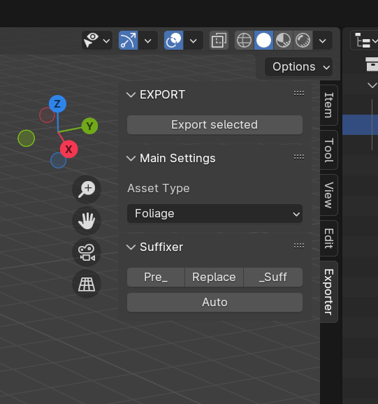
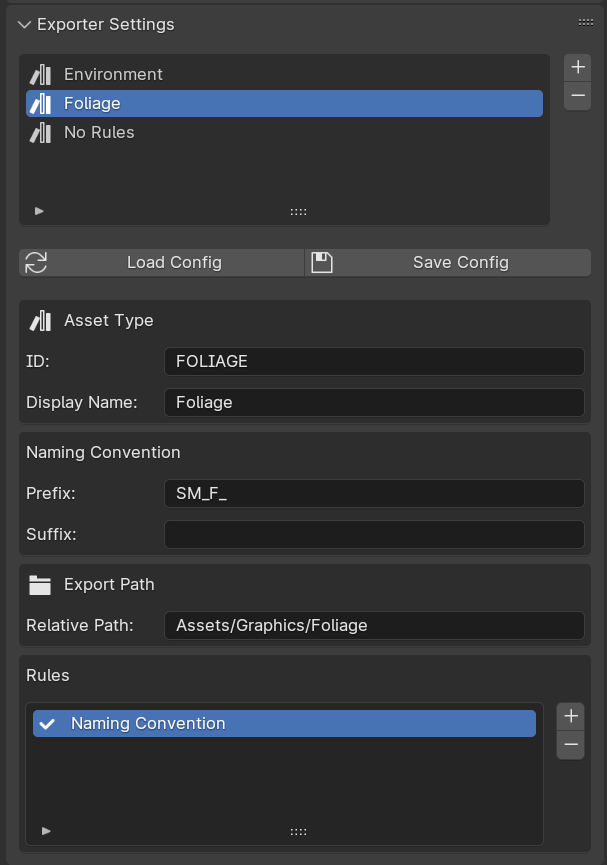
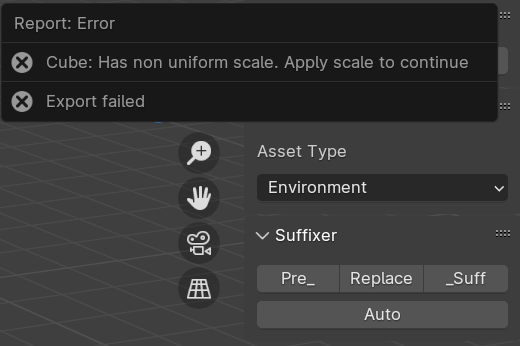

> INFO: **Work In Progress...**

# Blender to Unity Exporter with validation

Created by **Maciej "Matheas" Sojka**

## Features
- Easy configuration of new Asset Types and validation rules
- Modular validation system
- UI separated from logic
- Serialisation
- Simple rule registration and extension
- Structured validation reporting
- Per-Asset-Type rule assignment
- Rule registry for dynamic validation lookup

#### Work in progress
🟢 Dynamic Project Path  
🟡 LOD support  
🟡 Export Collection  
🔴 Export multiple meshes as separate files  
🔴 Metadata support  
🔴 Additional asset-type-specific windows  
🔴 Backward compatibility json  
🔴 Config versioning  
🔴 More validation rules  
🔴 Export support for Unreal and custom pipelines  
🔴 Export Profiles  
🔴 Validation Log  
🔴 QoL  

