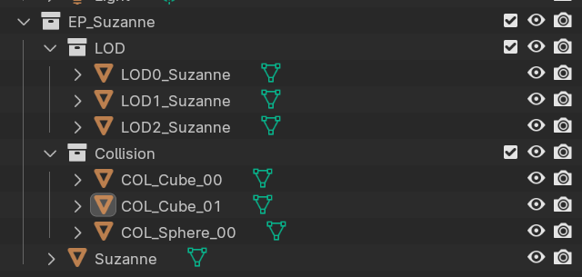

> INFO: **Work In Progress...**  
> repository title on github is temporal

# DCC-Agnostic Asset Pipeline Tool "EVA" 
#### EXPORTER • VALIDATION • AUTOMATION

---
Created by **Maciej "Matheas" Sojka**

## Features
- DCC Agnostic (wip)
  - One core, multiple adapters. Use DCC you like
- Component-Based data
  - Get data based of what validation rule need not all at once
  - Add new components without reworking whole tool
- Validation Rules Domains
  - different type of asset in export package is validated differently
- Adapter Interfaces
- Easy configuration of new Asset Types and validation rules
- Modular validation system
- UI separated from logic
- Serialisation
- Simple rule registration and extension
- Structured validation reporting
- Per-Asset-Type rule assignment
- Rule registry for dynamic validation lookup

🔴 Not Started  
🟡 In progress  
🟢 Ready  

### DCC-Agnostic Exporter readiness:
- 🟢 Suffixer
- 🟢 Rules
- 🟢 Validation
- 🟢 Collision
- 🟢 Export
- 🟢 Export Collection
- 🔴 LOD support

### Adapters:
- 🟡 Blender
- 🔴 Houdini
- 🔴 Maya
- [...]

#### Work in progress:
- 🟢 Dynamic Project Path  
- 🟢 Component-based data   
- 🟢 Export Collection  
- 🟢 Rule check domain
- 🟡 LOD support  
  - 🔴 Optional LOD ranges
  - 🔴 Optional auto decimate
- 🟡 Collision support  
  - 🟢 Cube/Sphere Shape
  - 🔴 Capsule
  - 🔴 Convex
  - 🔴 Dynamic collision window with helpers
- 🔴 Additional asset-type-specific windows  
- 🔴 Selected Export Package context
- 🔴 Export multiple meshes as separate files  
- 🔴 Metadata support  
- 🔴 Backward compatibility json  
- 🔴 Config versioning  
- 🔴 More validation rules  
- 🔴 Export support for Unreal and custom pipelines  
- 🔴 Export Profiles  
- 🔴 Validation Log  
- 🔴 QoL  

